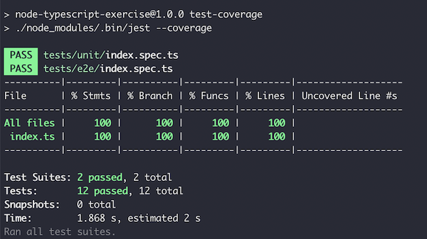

# Project Structure
```
├── src
│   ├── index.ts
│   └── main.ts
├── tests
│   ├── e2e
│   │   └── index.spec.ts
│   └── unit
│       └── index.spec.ts
```

# Requirements
node v18 latest LTS

# Getting started

```bash
npm install
npm start
```

# Testing

## Running the test suite
```bash
npm install
npm test
```

## Code coverage
```bash
npm run test-coverage
```



There are many test approaches (TDD, BDD, acceptance testing, integration testing...) testing methodolies/approaches should not be a dogma, my main principles are:

* DO test your code!!
* More is always better than less (it is not a big mistake having some test scenarios pretty similar)

 So for the sake of simplicity, as part of this exercise two different levels of testing are provided:
 * **Unit testing** where third party libs are mocked when used (e.g. axios)
 * **e2e** (end to end) testing where real http calls are performed

## Notes
```
The function should parse the retrieved data as an array of objects and merge
the arrays based on the key. If the key is present in multiple objects, the object
from the last endpoint in the array should overwrite the previous objects.
```

* Assumed that this is asking to overwrite the entire object
* Assumed that only those objects that contains the key have to be overwritten
* Merge algorithm O(n) or linear complexity, not concerning while no special performance requirements
* Promises resolved with **Promise.allSettled** instead of **Promise.resolve**, assumed that might be interesting obtaining a result even when one single http call fails